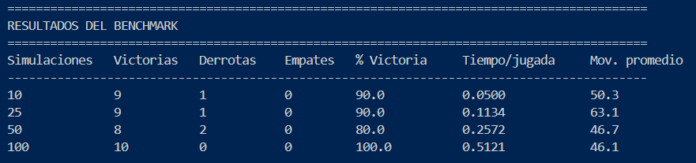
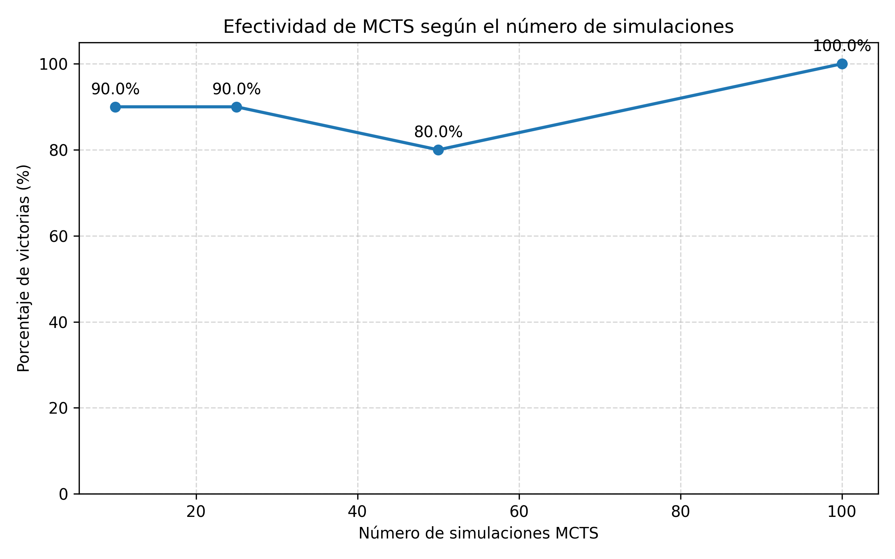
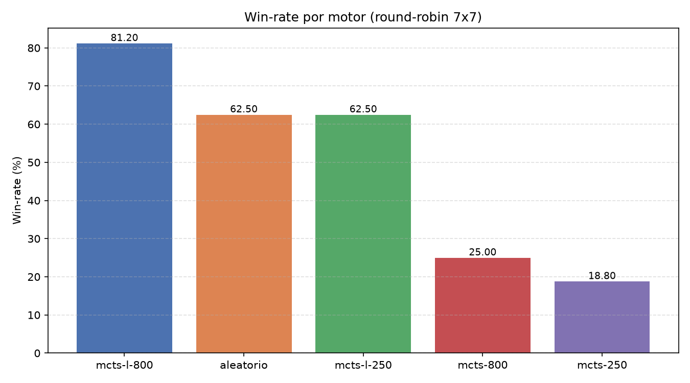
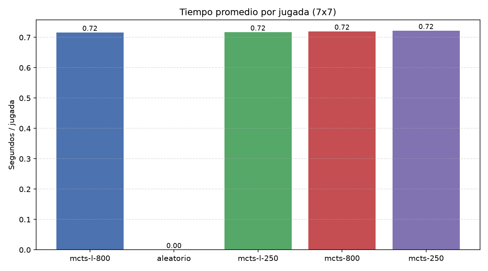
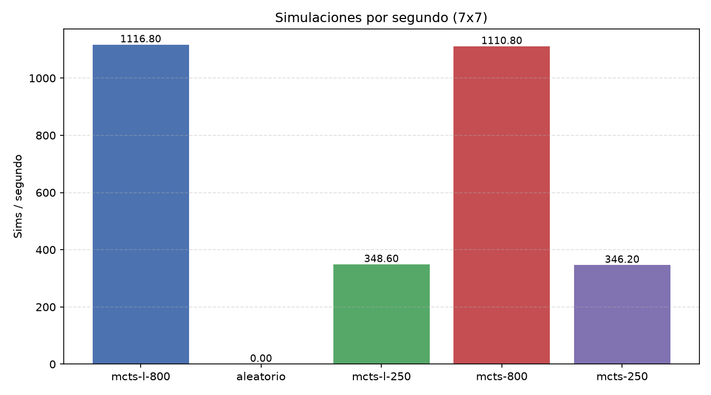
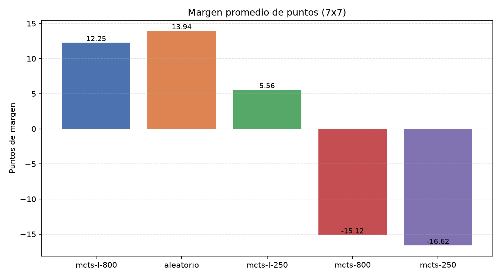
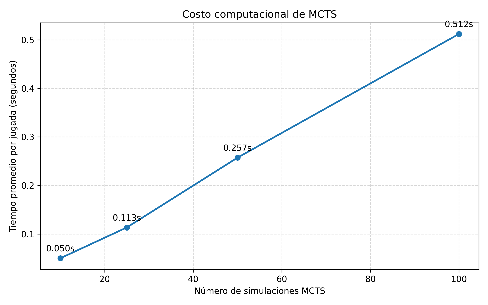
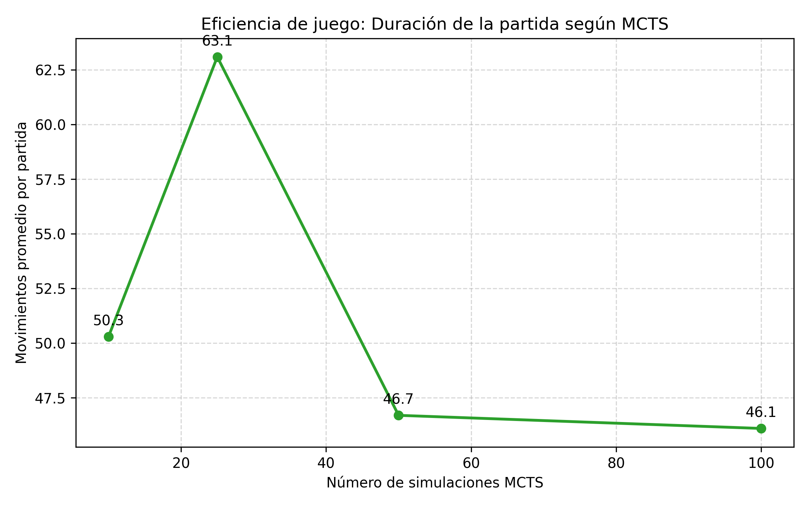

# AlphaGo – Implementación de Go con MCTS

## Integrantes

- **Lina María Castañeda Hernández**
- **Jorge Antonio García Romero**

## Descripción del Repositorio

Este Repositorio desarrolla una aplicación capaz de jugar **Go**, inspirada en los conceptos presentados en el documental *AlphaGo*.

El objetivo principal es implementar una aplicación que pueda jugar GO usando las reglas fundamentales del juego y  simular alphaGo en este usando solo **Monte Carlo Tree Search (MCTS)** sin redes neuronales de política (propone un movimiento) y valor (calcula el valor futuro de quedar en esa posición) tal y como es el AlphaGo.

La aplicación incluye dos implementaciones de MCTS: una **heurística** con UCT y playouts guiados, y la **MCTS L** (el MCTS, con rollout aleatorio puro). Ambas pueden enfrentarse entre sí, contra un jugador aleatorio (se colocan las fichas en una posición válida aleatoriamente) o contra una persona mediante la aplicación web.

---

# 1. Estructura del repositorio

```text
AlphaGo/
│
├── app.py                    # Servidor Flask (API REST + frontend)
├── motor/
│   ├── board.py              # Tablero, grupos, libertades, capturas, ko
│   └── scoring.py            # Fin de partida y conteo por área
├── ia/
│   ├── mcts.py               # MCTS + UCT (heurístico)
│   ├── mcts_lina.py          # MCTS estilo académico (rollout aleatorio)
│   ├── rival_lina.py         # Adaptador MCTS L (handicap de simulaciones)
│   ├── experimento.py        # Duelos entre configuraciones de IA
│   └── torneo.py             # Torneo round-robin paralelo
├── almacenamiento/
│   ├── store.py              # Persistencia JSON + rankings
│   └── perf.py               # Métricas de rendimiento de la app
├── static/                   # Frontend (tablero SVG, replay, dashboard)
├── data/                     # Partidas, historial y SGF
├── pruebas/                  # Suite de pruebas (pytest)
├── README.md
└── PLAN.md
```

### `motor/`

Contiene la lógica principal del juego de Go:

- Creación del tablero.
- Colocación de piedras.
- Alternancia de turnos.
- Detección de vecinos.
- Identificación de grupos.
- Cálculo de libertades.
- Captura de piedras.
- Prevención de suicidio.
- Regla de Ko.
- Pase de turno.
- Finalización por dos pases consecutivos.
- Generación de movimientos válidos.
- Copia del estado del juego.
- Cálculo de puntuación.

### `ia/mcts.py`

Implementa el agente de inteligencia artificial mediante **Monte Carlo Tree Search (MCTS)** con UCT y playouts heurísticos.

### `ia/mcts_lina.py` y `ia/rival_lina.py`

Incluyen la implementación de **MCTS L** (el MCTS, con rollout aleatorio puro) y su adaptador, que aplica un handicap de simulaciones para duelos equilibrados.

### `ia/experimento.py` y `ia/torneo.py`

Permiten enfrentar configuraciones de IA (`aleatorio`, `mcts-<sims>`, `mcts-l-<sims>`), en duelos individuales o en torneos round-robin paralelos.

### `pruebas/`

Contiene las pruebas unitarias del motor, del MCTS, de la IA y de la API.

---

# 2. Motor de Go

El tablero se representa mediante una matriz cuadrada.

Se utilizan los siguientes valores:

```python
VACIO = 0
NEGRA = 1
BLANCA = -1
```

Por defecto, el motor puede trabajar con un tablero de 9×9, aunque para las pruebas de desempeño se utilizó un tablero reducido de **5×5** con el objetivo de disminuir el costo computacional de los experimentos.

Una de las partes fundamentales de la implementación consiste en determinar las **libertades** de las piedras.

En Go, una piedra o grupo permanece en el tablero mientras tenga al menos una intersección vacía adyacente. Cuando un grupo pierde todas sus libertades, es capturado y retirado del tablero.

El motor también verifica que una jugada sea válida antes de modificar permanentemente el estado de la partida.

---

# 3. Inteligencia Artificial

La inteligencia artificial utiliza **Monte Carlo Tree Search (MCTS)**.

MCTS permite analizar posibles decisiones construyendo progresivamente un árbol de búsqueda y realizando simulaciones de partidas.

Cada iteración está compuesta por cuatro etapas principales.

## 3.1 Selección

El algoritmo recorre el árbol existente seleccionando los nodos más prometedores usando UCT

Para equilibrar la exploración de nuevas posibilidades y el aprovechamiento de movimientos que anteriormente obtuvieron buenos resultados, se utiliza el criterio **UCT (Upper Confidence Bound applied to Trees)** este se encarga de calcular un puntaje para cada nodo hijo y elige el que tenga valor mas alto haciendo uso de una ecuación que se compone por el termino de **explotación** que es la rentabilidad, en este caso # de victorias pasando por el nodo y sobre numero de veces que el nodo ha sido visitado (tasa de victorias del nodo) y de **Exploración** que mide que tan "ignorado" esta el nodo, con estas dos escoge el camino a seguir.

## 3.2 Expansión

Cuando se encuentra un nodo que todavía contiene movimientos sin explorar, se selecciona uno de ellos y se crea un nuevo nodo en el árbol.

El pase de turno también se considera una acción posible.

## 3.3 Simulación

Desde el nuevo estado se ejecuta una partida simulada mediante movimientos aleatorios.

La simulación continúa hasta que:

- ambos jugadores pasan consecutivamente, o
- se alcanza un límite máximo de movimientos.

Posteriormente se calcula la puntuación del tablero para determinar el ganador de la simulación.

## 3.4 Retropropagación

El resultado obtenido durante la simulación se propaga desde el nodo explorado hasta la raíz.

Cada nodo registra:

- número de visitas;
- número de victorias;
- movimiento realizado;
- jugador que realizó el movimiento.

Esto permite evaluar los resultados desde la perspectiva correspondiente a cada jugador.

## 3.5 Diferencias de diseño entre las dos implementaciones de MCTS

El proyecto contiene **dos** implementaciones independientes de MCTS, cada una
con su propio árbol, heurística de simulación y estrategia de expansión. La
diferencia central es *qué hace cada una durante la simulación (rollout)* y
*cómo construye el árbol*.

| Aspecto | MCTS heurístico (`ia/mcts.py`) | MCTS L (`ia/mcts_lina.py`) |
|---|---:|---:|
| **Rollout** | Playouts guiados (`ia/rollout.py`): pesos por capturas estimadas, vecinos vacíos y una probabilidad de pase progresiva según lo lleno que esté el tablero. | Rollout **aleatorio puro**, con un 5 % de pases voluntarios. |
| **Expansión** | **Perezosa**: al visitar un nodo se expanden *todos* sus movimientos legales de una vez (dict de hijos). | **Un hijo por iteración**: se elige un movimiento aleatorio pendiente, se juega y se crea un solo nodo nuevo. |
| **Constante UCT** | `exploracion = 1.4`. | `constante_exploracion = 1.414` (la clásica √2). |
| **Longitud del rollout** | `pliegues_rollout = 40` movimientos fijos. | `tamano * tamano` (juego más largo), configurable con `pliegues_rollout`. |
| **Decisión final** | Hijo con más visitas, desempatando por mayor Q. | Hijo con más visitas. |
| **Valor retropropagado** | `0.0 / 0.5 / 1.0` según el resultado, alternando la perspectiva por nivel. | Victoria entera (o `0.5` en empate) desde la perspectiva de quien movió. |
| **Límite de tiempo** | Respeta `tiempo_limite_ms` en el bucle principal. | Idem, de forma nativa (sin calibración). |

Estas diferencias explican por qué, a **igual número de simulaciones**, el MCTS
heurístico es más fuerte que la MCTS L: sus playouts juegan movimientos
razonables (capturar, ocupar libertades) en lugar de movimientos al azar, por
lo que el valor estimado de cada nodo se parece más al resultado real. Para
equilibrar los duelos, el adaptador `ia/rival_lina.py` aplica un **handicap de
simulaciones (`HANDICAP_LINA = 3`)**: `mcts-l-250` realmente ejecuta
**750** simulaciones, `mcts-l-800` ejecuta **2400**.

## 3.6 IAs disponibles

La aplicación incluye tres jugadores automáticos, identificados por una configuración:

- `aleatorio` — jugador de referencia: elige una jugada legal al azar (baseline).
- `mcts-<sims>` — el MCTS propio con UCT y playouts heurísticos. Las simulaciones se configuran (por ejemplo, `mcts-250`, `mcts-800`, `mcts-2000`).
- `mcts-l-<sims>` — la **MCTS L**, el MCTS (UCT clásico con rollout aleatorio puro), portado a nuestro motor. Su adaptador aplica un handicap de simulaciones (`HANDICAP = 3`) porque su rollout aleatorio es más débil que el heurístico a igualdad de simulaciones (ver §3.5).

### 3.7 Modos de juego y comparación entre IAs

La aplicación web permite jugar en varios modos:

- **PvP local** — dos jugadores humanos en el mismo tablero.
- **Humano vs IA** — una persona contra el MCTS configurado.
- **IA vs IA** — dos MCTS juegan automáticamente.
- **Duelo MCTS vs MCTS L** — enfrenta el MCTS heurístico contra la MCTS L, cada lado con su configuración.

Para comparar IAs también se dispone de:

- **Experimentos** (`/api/ai/experiment`, `ia/experimento.py`): duelos entre configuraciones arbitrarias (`aleatorio`, `mcts-<sims>`, `mcts-l-<sims>`) con semilla reproducible, agregando victorias, empates, movimientos y tiempos promedio.
- **Torneo round-robin** (`/api/ai/torneo`, `ia/torneo.py`): juega en paralelo (procesos) todas las parejas de configuraciones en un tablero pequeño, y agrega por configuración victorias, derrotas, margen promedio, tiempo por jugada y sims por segundo.

---

# 4. Pruebas

Se implementaron pruebas unitarias para verificar el comportamiento

Las pruebas del motor comprueban, entre otros aspectos:

- inicialización correcta del tablero;
- movimientos válidos;
- alternancia de turnos;
- movimientos fuera de los límites;
- casillas ocupadas;
- vecinos;
- libertades;
- grupos;
- capturas;
- regla de no suicidio;
- regla de Ko;
- pases y finalización de la partida.

Las pruebas de la IA verifican que:

- pueda seleccionar acciones;
- seleccione movimientos legales;
- no juegue sobre posiciones ocupadas;
- la búsqueda MCTS no modifique el tablero real mientras analiza;
- los movimientos seleccionados puedan ser ejecutados por el motor.

Además, las pruebas de la **MCTS L** verifican su integración con el motor (configuraciones `mcts-l-<sims>`, handicap del adaptador y respeto del límite de tiempo), y las pruebas de la API cubren los modos de juego (PvP, humano vs IA, IA vs IA, duelo) y los endpoints de experimentos y torneo.

---

# 5. Evaluación del desempeño

Para analizar el comportamiento se desarrolló un benchmark que enfrenta el agente MCTS contra un jugador que selecciona movimientos legales de manera aleatoria.

El experimento se realizó sobre un tablero **5×5**.

Se probaron cuatro configuraciones:

- 10 simulaciones MCTS.
- 25 simulaciones MCTS.
- 50 simulaciones MCTS.
- 100 simulaciones MCTS.

En cada configuración se ejecutaron **10 partidas**, alternando el color de la IA entre negras y blancas para reducir el efecto de jugar siempre en la misma posición de turno.

Las métricas utilizadas fueron:

- victorias;
- derrotas;
- empates;
- porcentaje de victorias;
- tiempo promedio de decisión por jugada;
- número promedio de movimientos por partida.

---

# 6. Resultados experimentales

Los resultados obtenidos en la ejecución analizada fueron:

| Simulaciones MCTS | Victorias | Derrotas | Empates | Porcentaje de victoria | Tiempo promedio/jugada | Movimientos promedio |
|---:|---:|---:|---:|---:|---:|---:|
| 10 | 9 | 1 | 0 | 90 % | 0.0500 s | 50.3 |
| 25 | 9 | 1 | 0 | 90 % | 0.1134 s | 63.1 |
| 50 | 8 | 2 | 0 | 80 % | 0.2572 s | 46.7 |
| 100 | 10 | 0 | 0 | 100 % | 0.5121 s | 46.1 |


---

# 7. Análisis de efectividad

La siguiente gráfica muestra el porcentaje de victorias obtenido por cada configuración.



En la muestra evaluada, todas las configuraciones alcanzaron porcentajes de victoria iguales o superiores al **80 %** frente al jugador aleatorio.

Los resultados fueron:

- 10 simulaciones: **90 %**
- 25 simulaciones: **90 %**
- 50 simulaciones: **80 %**
- 100 simulaciones: **100 %**

La configuración de 100 simulaciones obtuvo el mejor resultado de esta ejecución, ganando las 10 partidas realizadas.

Sin embargo, el porcentaje de victorias no aumentó de forma estrictamente progresiva. La configuración de 50 simulaciones obtuvo un resultado inferior a las configuraciones de 10 y 25 simulaciones.

Esto no permite concluir que 50 simulaciones sean necesariamente peores. MCTS contiene componentes estocásticos(aleatorios) y el oponente utilizado en el benchmark también selecciona movimientos aleatoriamente. Adicionalmente, una muestra de 10 partidas por configuración produce una variabilidad considerable: una sola partida representa 10 puntos porcentuales del resultado.


---

# 7.1 Benchmark multi-motor (round-robin 7×7)

Además del benchmark clásico contra aleatorio, se compararon **todas** las IAs
entre sí mediante un torneo round-robin en tablero **7×7**. Se jugaron `4`
partidas por cada pareja, alternando colores (16 partidas por configuración),
con un límite de `700 ms` por jugada.

Las configuraciones (con su significado, ver §3.5):
`aleatorio`, `mcts-250`, `mcts-800`, `mcts-l-250`, `mcts-l-800`.









Resultados de la ejecución documentada:

| Configuración | Victorias | Partidas | Win-rate | Margen prom. | Tiempo/jugada | Sims/s |
|---|---:|---:|---:|---:|---:|---:|
| `mcts-l-800` | 13 | 16 | 81.2 % | +12.3 | 716 ms | 1117 |
| `aleatorio` | 10 | 16 | 62.5 % | +13.9 | 0.4 ms | — |
| `mcts-l-250` | 10 | 16 | 62.5 % | +5.6 | 717 ms | 349 |
| `mcts-800` | 4 | 16 | 25.0 % | -15.1 | 720 ms | 1111 |
| `mcts-250` | 3 | 16 | 18.8 % | -16.6 | 722 ms | 346 |

La **MCTS L** (que aplica el handicap `HANDICAP_LINA = 3`, es decir que
`mcts-l-800` ejecuta en realidad **2400** simulaciones, ver §3.5) obtuvo el
mejor win-rate. Nótese que `aleatorio` aparece con win-rate positivo porque
en el round-robin cada motor también juega contra los demás, y su única
fuente de puntos proviene de derrotar a configuraciones débiles.

Es importante interpretar estos números con cautela: con solo 16 partidas por
configuración y oponentes estocásticos, una victoria representa ~6 puntos
porcentuales de win-rate, por lo que las diferencias entre `mcts-250` y
`mcts-800` de esta muestra no son concluyentes. La métrica más estable es la
de **simulaciones por segundo** (coste computacional), que distingue
claramente la velocidad de cada implementación: MCTS heurístico y MCTS L con
los mismos sims llevan costes parecidos, pero MCTS L juega 3× más
simulaciones reales gracias al handicap.

# 8. Costo computacional



El efecto más claro observado durante el experimento corresponde al incremento del costo computacional.

Los tiempos promedio fueron:

| Simulaciones | Tiempo promedio por jugada |
|---:|---:|
| 10 | 0.0500 s |
| 25 | 0.1134 s |
| 50 | 0.2572 s |
| 100 | 0.5121 s |

Al pasar de 10 a 100 simulaciones, la cantidad de simulaciones aumenta **10 veces**, mientras que el tiempo promedio pasa de aproximadamente **0.05 a 0.51 segundos por decisión**.

Esto representa un incremento aproximado de **10.2 veces** en el tiempo de procesamiento.

Por lo tanto, en las condiciones de este experimento se observa una relación aproximadamente lineal entre el número de simulaciones MCTS y el costo temporal de la toma de decisiones.

---

# 9. Duración de las partidas



También se analizó el número promedio de movimientos realizados durante las partidas.

Los resultados fueron:

- 10 simulaciones: 50.3 movimientos.
- 25 simulaciones: 63.1 movimientos.
- 50 simulaciones: 46.7 movimientos.
- 100 simulaciones: 46.1 movimientos.

No se observa una relación estrictamente lineal entre el número de simulaciones y la duración de la partida.

La configuración de 25 simulaciones produjo las partidas más largas, mientras que las configuraciones de 50 y 100 simulaciones presentaron valores similares y menores.

Debido al carácter aleatorio del adversario y de las simulaciones, esta métrica debe considerarse secundaria y requeriría un número mayor de partidas para establecer una tendencia.


---

# 11. Variabilidad experimental

MCTS es un algoritmo con componentes aleatorios.

Durante la expansión y simulación pueden seleccionarse diferentes movimientos en ejecuciones distintas. El adversario utilizado para el benchmark también utiliza una estrategia aleatoria.

Como consecuencia, ejecutar nuevamente el mismo experimento puede producir porcentajes de victoria diferentes.

---

# 12. Relación con AlphaGo

El documental *AlphaGo* muestra cómo el juego de Go representa un desafío significativo para la inteligencia artificial debido a la enorme cantidad de posibles configuraciones del tablero.

La implementación realizada en este proyecto utiliza **Monte Carlo Tree Search**, uno de los componentes fundamentales asociados al enfoque utilizado por AlphaGo.

Sin embargo, existen diferencias importantes.

Esta aplicación utiliza:

- MCTS.
- UCT para selección.
- simulaciones aleatorias.
- un motor propio para validar las reglas de Go.

---

# 13. Conclusiones

La implementación permitió desarrollar un motor funcional de Go y un agente capaz de seleccionar movimientos mediante Monte Carlo Tree Search.

Las pruebas unitarias permitieron verificar las principales reglas del juego y comprobar que la IA puede analizar movimientos sin modificar accidentalmente el estado real de la partida.

Los experimentos muestran que el agente MCTS logra superar con frecuencia a un jugador aleatorio en un tablero reducido de 5×5.

El resultado más consistente del benchmark corresponde al costo computacional: aumentar la cantidad de simulaciones incrementa aproximadamente de manera proporcional el tiempo necesario para seleccionar una jugada.

En términos de efectividad, una mayor cantidad de simulaciones permite realizar una búsqueda más extensa, pero los resultados presentan variabilidad debido a los componentes aleatorios del algoritmo y al tamaño reducido de la muestra.

En la ejecución analizada, la configuración de 100 simulaciones obtuvo 10 victorias en 10 partidas, aunque necesitó aproximadamente 0.51 segundos por decisión. En contraste, la configuración de 10 simulaciones obtuvo 9 victorias en 10 partidas utilizando aproximadamente 0.05 segundos por jugada.

La comparación entre el MCTS heurístico y la MCTS L se realiza mediante el modo **duelo** de la aplicación y mediante **experimentos y torneos** (`ia/experimento.py`, `ia/torneo.py`), que permiten medir win-rate, margen, tiempo por jugada y sims por segundo para cada configuración.

---

# 14. Ejecución

## Instalar dependencias

```bash
pip install -r requirements.txt
```

## Ejecutar la aplicación web

```bash
python app.py
```

Luego abre `http://127.0.0.1:5000`.

## Ejecutar las pruebas

```bash
pytest pruebas/
```

## Ejecutar el benchmark / duelos entre IA

```bash
python -m ia.experimento
```

## Regenerar el benchmark multi-motor y las gráficas

```bash
python -m scripts.benchmark_graficas --partidas 4 --tiempo 700
```

Genera `benchmark_winrate.png`, `benchmark_tiempo.png`, `benchmark_sims.png`
y `benchmark_margen.png`, y guarda el resumen en `data/benchmark_roundrobin.json`.

## Desplegar en Render

El repositorio incluye un blueprint `render.yaml`:

- Servidor: `gunicorn app:app --bind 0.0.0.0:$PORT --workers 1 --threads 4`
  (un solo worker: el estado de las partidas vive en memoria del proceso).
- Instalación: `pip install -r requirements.txt`
- `app.py` lee la variable de entorno `PORT` proporcionada por Render.

Para un deploy manual en Render: crea un *Web Service* apuntando al repo,
asigna el comando de arranque de arriba y añade la variable `PYTHON_VERSION=3.12`.

---

